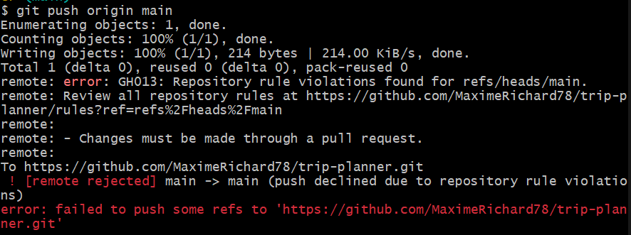

# Stratégie DevOps — Trip Planner

## 1. Présentation du projet
Trip Planner est une application web de planification d'itinéraires routiers français,
développée en Symfony 7 / Twig. Elle permet de saisir une adresse de départ, des arrêts
intermédiaires et de générer une feuille de route ordonnée selon la distance.

**Stack technique :**
- Backend : PHP 8.2 / Symfony 7
- Frontend : Twig (monolithe, sans framework JS)
- Base de données : PostgreSQL via Supabase
- Conteneurisation : FrankenPHP (Docker)
- API : Base Adresse Nationale (BAN)

## 2. Gestion du dépôt
- Dépôt public GitHub : https://github.com/MaximeRichard78/trip-planner
- Conventional Commits appliqués sur toutes les branches
- Fichier `.gitignore` adapté à Symfony (vendor/, .env, var/, cache/)
- `.env.example` documentant toutes les variables d'environnement nécessaires

## 3. Stratégie de branches
| Branche | Rôle |
|---------|------|
| `main` | Production stable, protégée par ruleset GitHub |
| `develop` | Intégration continue des features |
| `feature/*` | Développement isolé de chaque fonctionnalité |

Les merges vers `main` se font exclusivement via Pull Request après passage du CI.

> Preuve : tentative de push direct sur `main` rejetée par le ruleset GitHub.

## 4. Qualité de code
- **PHP-CS-Fixer** : linting automatique selon le standard PSR-12 / Symfony
- **PHPStan** : analyse statique au niveau 5
- Scripts Composer standardisés :
  - `composer lint` — vérifie le style
  - `composer lint:fix` — corrige automatiquement
  - `composer analyse` — analyse statique
  - `composer check` — enchaîne lint + analyse

## 5. Stratégie de tests
- Framework : PHPUnit 13
- Pattern : AAA (Arrange / Act / Assert)
- Couverture : 100% sur les services métier (`RouteCalculator`, `BanApiClient`)
- Les appels HTTP vers l'API BAN sont mockés via `MockHttpClient`
- Couverture générée avec Xdebug 3 (`composer test:coverage`)

## 6. Pipeline CI (GitHub Actions)
Fichier : `.github/workflows/ci.yml`

Étapes automatisées à chaque push / PR :
1. Checkout du code
2. Installation de PHP 8.2 + extensions
3. `composer install`
4. `composer lint`
5. `composer analyse`
6. `composer test`

Le badge CI est affiché dans le `README.md`.

## 7. Conteneurisation
- Image de base : `dunglas/frankenphp`
- `Dockerfile` : installation des dépendances Composer, copie du code, exposition port 80/443
- `docker-compose.yml` : service `app` + variables d'environnement Supabase injectées
- Healthcheck configuré sur l'endpoint `/`
- Lancement : `docker compose up -d`

## 8. Sécurité
### Secrets & variables d'environnement
- Aucun secret ne figure dans le code source ou dans Git
- Les credentials Supabase sont injectés via GitHub Secrets en CI et via `.env` en local
- `.env` est listé dans `.gitignore`

### Bonnes pratiques appliquées
- Secret Scanning activé sur le dépôt GitHub
- Dependabot activé pour les dépendances Composer et les actions GitHub
- 5 risques DevOps identifiés et documentés (voir section 12)

## 9. Base de données
- Hébergement : Supabase (PostgreSQL managé)
- Connexion via Doctrine ORM avec `DATABASE_URL` en variable d'environnement
- Aucune donnée sensible stockée (application publique/familiale sans authentification)
- Migrations gérées via `symfony console doctrine:migrations:migrate`

## 10. API Base Adresse Nationale (BAN)
- URL : https://api-adresse.data.gouv.fr/search/
- Utilisation : géocodage des adresses françaises (autocomplétion + coordonnées GPS)
- Restriction géographique : France métropolitaine uniquement
- Service PHP dédié : `BanApiClient` (avec interface HTTP mockable pour les tests)

## 11. Algorithme d'itinéraire
1. Récupération des coordonnées GPS de chaque adresse via l'API BAN
2. Calcul des distances depuis le point de départ (formule de Haversine)
3. Tri des arrêts intermédiaires
4. Placement de l'arrêt final selon le mode choisi :
   - **"Loin"** → l'arrêt le plus éloigné du départ est mis en dernière position
   - **"Proche"** → l'arrêt le plus proche du départ est mis en dernière position
5. Affichage de la feuille de route avec liens Waze et Google Maps

## 12. Risques DevOps identifiés

| # | Risque | Impact | Mitigation |
|---|--------|--------|------------|
| 1 | Exposition de secrets (clés Supabase) dans Git | Critique | `.gitignore`, Secret Scanning, GitHub Secrets |
| 2 | Dépendances Composer vulnérables | Élevé | Dependabot, `composer audit` |
| 3 | Indisponibilité de l'API BAN | Moyen | Gestion d'erreurs HTTP, messages utilisateur explicites |
| 4 | Régression introduite sans CI | Élevé | Pipeline CI obligatoire avant merge sur `main` |
| 5 | Dérive de configuration entre local et production | Moyen | Docker, `.env.example`, documentation des variables |